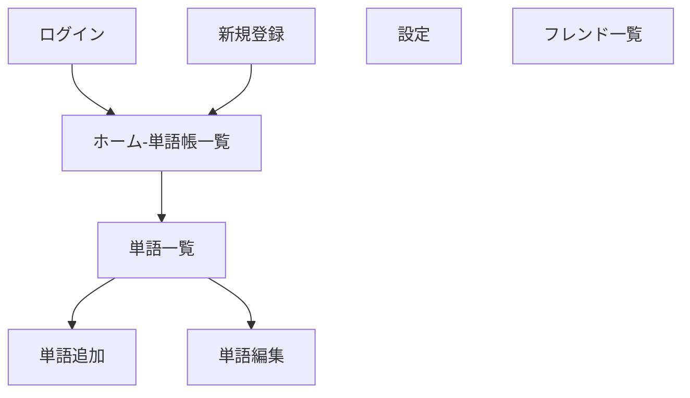

# 画面一覧

- ログイン
- 新規登録
- ホーム(単語帳一覧)
- 設定
- フレンド一覧
- 単語一覧
- 単語追加
- 単語編集

## 画面遷移図

```mermaid
flowchart TD

Login[ログイン]
Register[新規登録]
Home[ホーム-単語帳一覧]
Setting[設定]
FriendList[フレンド一覧]
WordList[単語一覧]
AddWord[単語追加]
EditWord[単語編集]

Login --> Home
Register --> Home
Home --> WordList
WordList --> AddWord
WordList --> EditWord
```